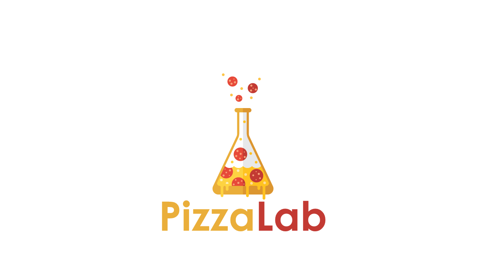

# PizzaLab

This is a **DialogFlow** Agent used like example for the Codelab made on 2018-09-25.

The idea of this one is manage some entities and intents with a Fulfillment made with **Firebase Cloud Functions**.

The dependencies of the Cloud Functions are:

    "actions-on-google": "^2.2.0",
    "dialogflow": "^0.6.0",
    "dialogflow-fulfillment": "^0.5.0",
    "firebase-admin": "~6.0.0",
    "firebase-functions": "^2.0.3",
    "gmail-send": "^1.2.14"

The flow for the bot is this one:

You talk to the bot what type of food you want, the size, quantity and the ingredients. At the moment that the bot has all the information this send a request on the **fulfillment** where this is registered on the **Firebase Realtime Database**, after all this there is another function triggered on the creation for send an email to the client with the information of the order.